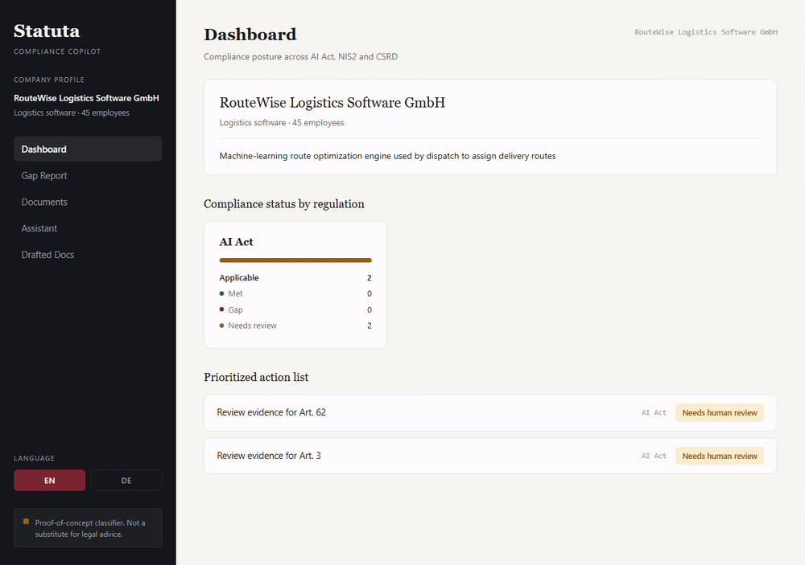

# AI Compliance Copilot ("Statuta")

### EU AI Act / NIS2 / CSRD assistant for German SMEs

## Problem

German SMEs are hit with three overlapping EU compliance regimes at once — the **AI Act**
(AI system risk classification & documentation), **NIS2** (cybersecurity governance), and
**CSRD** (sustainability reporting). DIHK's 2026 survey of ~5,000 companies names bureaucracy
and simultaneous compliance deadlines as a top blocker to digitalization, and most SMEs can't
afford dedicated compliance consultants or legal counsel.

This project is a copilot that ingests a company's internal documents (policies, data flows,
AI system descriptions, existing certifications) plus the relevant regulation texts, and produces:

- A **risk/gap report** — which obligations apply, which are met (with evidence quoted from
  your own uploaded documents), which have a gap
- **Auto-drafted documentation** (AI Act Annex IV technical documentation skeleton, per-section,
  with citations)
- A **conversational assistant** that answers "does this apply to us" questions with citations
  back to the source regulation article

It is a RAG + light fine-tuning + agentic drafting project, not a plain chatbot.

## Demo



No live-hosted version — every free tier with enough RAM for `torch` + `transformers` requires
a card for identity verification, which this project deliberately avoids requiring. See
[`DEPLOYMENT.md`](DEPLOYMENT.md) for the full story (including a Hugging Face Spaces attempt
that hit a genuine platform wall) and how to run it locally in under 5 minutes — see Setup below.

## Status

Weeks 1–3 of the build plan are functionally complete and verified end-to-end against real
data (real regulation text, a trained classifier, a live frontend, all confirmed working in an
actual browser against the real backend — not mocked). See [`docs/BUILD_PLAN.md`](docs/BUILD_PLAN.md)
for the full week-by-week log and component status table.

## Architecture

```
┌───────────────────┐      ┌───────────────────┐      ┌────────────────────┐
│  Static frontend    │◄────►│   FastAPI backend  │◄────►│  Supabase (Postgres │
│  (webapp/, vanilla   │      │  - RAG pipeline    │      │  + pgvector + Auth  │
│   HTML/CSS/JS)       │      │  - Agent/drafting  │      │  + Storage)         │
└───────────────────┘      │  - PyTorch model   │      └────────────────────┘
                            └───────────────────┘                  │
                                     │                    falls back to a local
                            ┌───────────────────┐          JSON store when no
                            │  LLM API (Claude/  │        Supabase project is
                            │  GPT) — not wired   │           configured yet
                            │  yet, no key set     │      (app/rag/local_store.py)
                            └───────────────────┘
```

## Repo layout

```
backend/             FastAPI service — RAG pipeline, drafting agent, PyTorch inference
webapp/               Static HTML/CSS/JS frontend — Dashboard, Gap Report, Documents,
                      Assistant, Drafted Docs. Calls the backend directly via fetch()
frontend/             Superseded Streamlit prototype — kept for reference, not maintained
pytorch_classifier/   Compliance-relevance classifier: dataset, training loop, eval, model card
data_pipeline/        Regulation ingestion (AI Act / NIS2 / CSRD) + synthetic SME profiles
supabase/             SQL schema + RLS policies
docs/                 Build plan, model card, architecture notes
```

## Setup

Each of `backend/` and `pytorch_classifier/` has its own `requirements.txt`.

```bash
python -m venv .venv
source .venv/Scripts/activate   # Windows Git Bash
pip install -r backend/requirements.txt -r pytorch_classifier/requirements.txt
cp .env.example .env  # fill in Supabase + LLM API keys — optional, falls back to a local store
```

Backend:

```bash
cd backend
uvicorn app.main:app --reload --port 8000
```

Frontend — see [`webapp/README.md`](webapp/README.md):

```bash
cd webapp
python -m http.server 5500
```

Open http://localhost:5500 (backend must already be running on :8000).

## Disclaimer

This is a portfolio / proof-of-concept project. The compliance classifier and drafted
documentation are **not** a substitute for legal advice. See
[`pytorch_classifier/README.md`](pytorch_classifier/README.md) for the classifier's model card
and known limitations.
